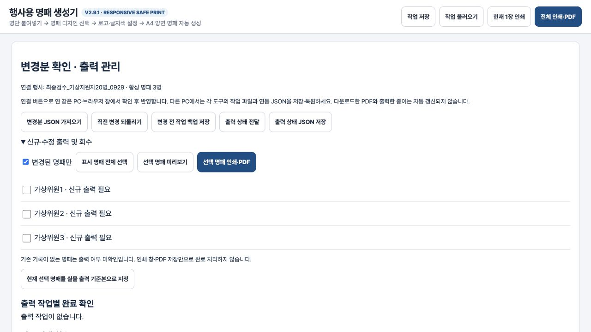
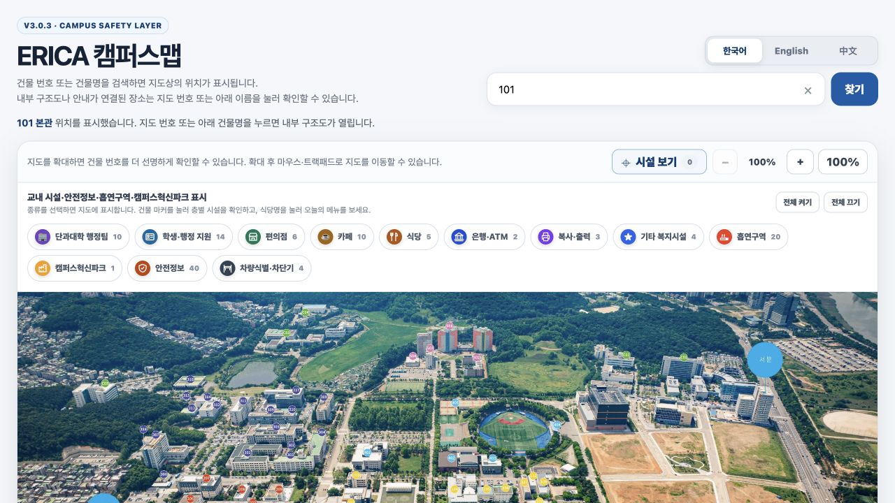
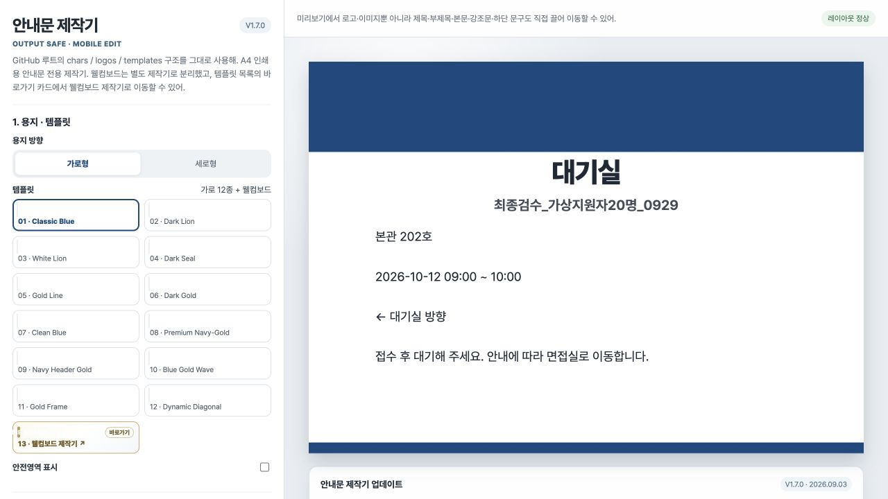

# 최종 MACH 연동 검증 · 2026-09-29

## 확인한 계약과 변경 범위

- 명패 `66312c3f480b0339e985c3cf35307f268c455b9c`, 안내문 `aa61afdb460479cdc378ac8a4329e6b8cbed5f3f`, 사이니지 `da904e8afdded05c825997262fb9392ef1084bef`, 행사 원큐 `8ce785ece90d6b4d7797f24fbe8fa2af36b226ca`의 기존 코드를 확인했습니다. 이 저장소들의 앱 소스는 변경하지 않았습니다.
- 캠퍼스맵은 등록된 건물 ID만 기존 검색 함수로 넘기는 8줄 확장과 회귀 테스트만 추가했습니다. PR #6, merge `a9704711845d31b9901283f6cf1e884f5d3162cc`. 기존 시설·안전정보·언어·검색 기능을 삭제하지 않았습니다.
- 기존 명패 앱은 다른 행사와 이미 연결되어 있으면 새 행사 roster를 거부합니다. 신규 면접 앱에 **새 명패 작업 JSON**을 추가하여 제작기의 공식 **작업 불러오기**로 전환하도록 보완했습니다. 같은 행사 수정은 기존 **변경분 JSON 가져오기**를 계속 사용하며 디자인과 로고를 유지합니다.
- 지도 수신 확장을 실제 배포한 뒤 신규 앱의 위치링크와 QR을 공개 `?building=<실제 ID>` 주소로 연결했습니다. 지원자 정보는 URL/QR에 포함하지 않습니다.
- 배포 사본에서 참조 저장소가 없으면 건너뛰던 2개 테스트를 제거하고, 실제 수신 계약 원본과 출처 커밋을 테스트 fixture로 동봉하여 모든 환경에서 검증합니다.

## 실제 UI 데이터로 검증

원큐 UI에서 처음부터 입력한 `최종검수_가상지원자20명_0929`의 백업을 사용했습니다. 지원자 20명, 면접위원 3명, 2개 날짜, 오전/오후 3개 Session입니다. 테스트 입력은 모두 가상 데이터입니다.

| 대상 | 결과 |
| --- | --- |
| 명패 신규 작업 import | IAB의 기존 명패 제작기 로컬 사본에서 실제 파일 선택으로 수신. 면접명, 위원 3명, 가상 학생지원팀, 팀장·위원장/담당자·면접위원이 정확히 표시되었습니다. |
| 명패 수정 roster | 첫 위원의 직위를 바꾼 파일을 **변경분 JSON 가져오기**로 수신. 변경 1명과 이전/이후 값 표시 → **선택한 변경 반영** → 새로고침 후 수정 직위와 나머지 2명 보존을 확인했습니다. |
| 명패 공개 사이트 | 실제 `https://erakeun.github.io/nameplate-maker/` 로딩과 수신 인터페이스를 확인했습니다. 기존 사용자의 다른 행사와 출력 이력이 있어 운영 브라우저의 기존 명단을 덮어쓰지 않았습니다. |
| 안내문 payload | 실제 UI 프로젝트의 본관 202호 대기실, 2026-10-12 09:00~10:00, 왼쪽 방향 및 대기 안내문을 공식 native 작업파일로 생성했습니다. 단위 테스트는 여러 날짜의 면접실/대기실/접수처 문구를 각각 검증합니다. |
| 안내문 공개 사이트 | 실제 `https://erakeun.github.io/notice-maker/` 로딩과 작업파일 인터페이스를 확인했습니다. 기존 '감사 예시' 작업을 보존했습니다. |
| 안내문 이번 UI import | 기존 앱의 가져오기 완료 알림으로 내부 브라우저 입력이 일시 정체됐으나, 검수 세션 정리 후 복구했습니다. 루트 담당자가 같은 로컬 제작기를 다시 열어 본관 202호·면접명·2026-10-12 09:00~10:00·왼쪽 방향·대기 안내 문구와 레이아웃 정상 상태를 확인했습니다. 새로고침 보존 및 실제 작업파일 재저장도 확인했습니다. |
| 지도 공개 배포 | IAB에서 `https://erakeun.github.io/erica-campus-map/?building=101`을 열어 검색값 101, `101 본관 위치를 표시했습니다`, 실제 본관 마커 및 기존 시설 UI를 확인했습니다. console error/warn 0. |
| QR | 앱이 사용하는 로컬 QR 생성기에서 실제 HTTP(S) 지도 주소를 matrix/SVG로 만드는 테스트 통과. QR 링크는 건물 101로 연결됩니다. 물리적인 휴대전화 스캔은 미검증입니다. |

## 자동 검증

- 원큐 통합 테스트 **12/12**, 실패/skip 0.
- 기존 명패 전체 단위 테스트 **72/72**, 실패/skip 0.
- 기존 지도 기존 시설 검사 + 새 건물 링크 검사 **3/3**, 실패/skip 0. 52개 실제 건물 모두 기존 검색 호출, 누락/잘못된 ID 무시, 언어 매개변수 보존을 확인했습니다.
- 명패 native 작업은 실제 수신기 `validateProject`를 통과하고 이후 같은 행사 `review`/`apply`까지 수행합니다. 연락처·지원자·운영 메모는 내보내기에서 제외됩니다.

## 화면 증거

미검증: 실제 프린터 출력, 휴대전화 QR 스캔. 제작기 운영 브라우저의 기존 작업을 보존하기 위해 수신·수정·재시작 검증은 수정하지 않은 실제 제작기 소스의 로컬 사본에서 수행했습니다. 운영 사이트에서는 실제 주소·수신 인터페이스·연결 파일을 확인했습니다.

